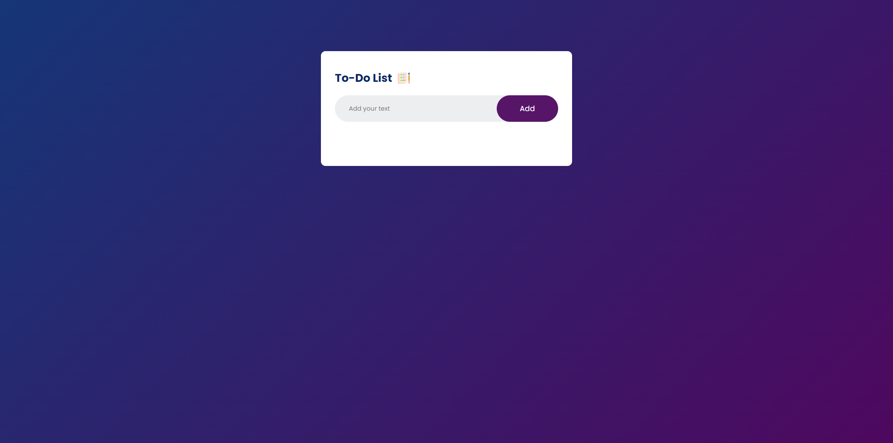

# To-Do List App

## Overview
This is a simple To-Do List web application built using HTML, CSS, and JavaScript. It allows users to add and remove tasks from their to-do list.

## Features
- Add tasks to the list
- Mark tasks as completed
- Remove tasks from the list
- Modal warning if trying to add an empty task

## Technologies Used
- HTML
- CSS
- JavaScript

## How to Use
1. Clone the repository to your local machine.
2. Open `index.html` in your web browser.

## Screenshots
